# EconAussie

[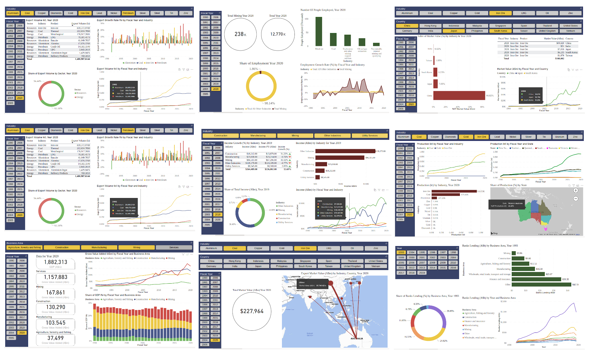 *Click for Intractive Dashboard*](https://app.powerbi.com/view?r=eyJrIjoiYzA3NzU2NmQtOWFmYS00N2QxLWI4ZTQtY2Q2NDUxMGQ4ZDFkIiwidCI6IjU0ZjZkMTYyLTIzYTgtNDMxNy1iOGRmLTYxMGVkMzU4MTA4YyJ9&pageName=ReportSection)

## ANALYSIS - Australia’s Economy
## Resources and Energy

 

### Profile

This analysis is a historical overview of some industries in the Resources & Energy sectors.  A story of how these sectors grew over the time and made a strong tie with Australia's economy and politics, as well as the country's geopolitics.

Interrogating data over three decades from 1990 - 2020 indicates that Australia has exported more than 20bt of refined and raw products which accounts for about 10% of the Australia’s Economy which is the second largest business sector after “Services”.

[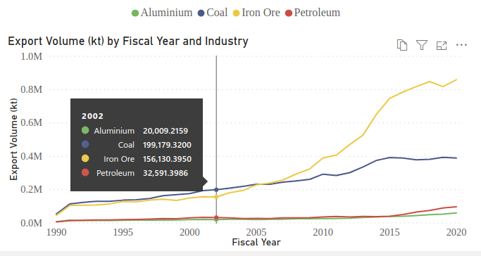 *Click for Intractive Dashboard - Page 1/9*](https://app.powerbi.com/view?r=eyJrIjoiYzA3NzU2NmQtOWFmYS00N2QxLWI4ZTQtY2Q2NDUxMGQ4ZDFkIiwidCI6IjU0ZjZkMTYyLTIzYTgtNDMxNy1iOGRmLTYxMGVkMzU4MTA4YyJ9&pageName=ReportSection)

Iron Ore and Coal are by far the two largest exported materials and right after them come Petroleum and Aluminium industries. Around 2010, Iron Ore overtook the coal and just last year (2019-20), $102 billion worth left Australia’s shores. The same period export value for Coal, Petroleum, and Aluminium was $55, $59, and $13 billion respectively.

[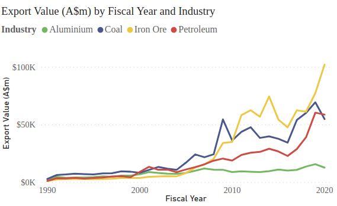 *Click for Intractive Dashboard - Page 2/9*](https://app.powerbi.com/view?r=eyJrIjoiYzA3NzU2NmQtOWFmYS00N2QxLWI4ZTQtY2Q2NDUxMGQ4ZDFkIiwidCI6IjU0ZjZkMTYyLTIzYTgtNDMxNy1iOGRmLTYxMGVkMzU4MTA4YyJ9&pageName=ReportSection)

The numbers reveal that Australia’s economy is highly dependent on fossil fuels and resources export. Just to pick one, Petroleum industries have shown such great growth from 2015-16 which overtook coal export in 2019-20 for the first time in almost two decades.

### Has Australia been drifting away from Manufacturing?

Sadly YES. Historical records show that Mining and Construction industries have grown so quickly year by year that both overtook Manufacturing as percent of GDP from 2010. An end to Australia's iconic car manufacturer - Holden - is apparently the most publicly discussed case of Manufacturing bust.

[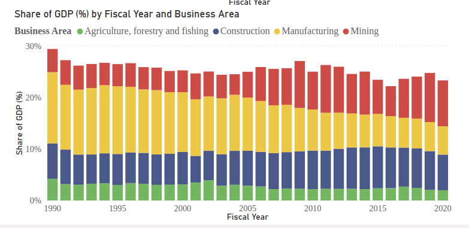 *Click for Intractive Dashboard - Page 3/9*](https://app.powerbi.com/view?r=eyJrIjoiYzA3NzU2NmQtOWFmYS00N2QxLWI4ZTQtY2Q2NDUxMGQ4ZDFkIiwidCI6IjU0ZjZkMTYyLTIzYTgtNDMxNy1iOGRmLTYxMGVkMzU4MTA4YyJ9&pageName=ReportSection)

From almost 14% of GDP in 1990-91, Manufacturing has ended up to 5.5% in 2019-20. While in the same period, Mining Industries has boomed to about 9% from 4.5%. Construction and Services also kept their steady growth while Agriculture has shrunk to some extent.

Despite its slow growth, Manufacturing has yet  kept investors positive by standing slightly on top of the Construction with more than $21 billion income in year 2019-20.

[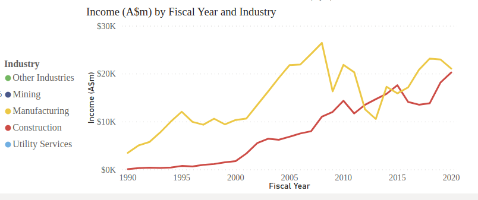 *Click for Intractive Dashboard - Page 5/9*](https://app.powerbi.com/view?r=eyJrIjoiYzA3NzU2NmQtOWFmYS00N2QxLWI4ZTQtY2Q2NDUxMGQ4ZDFkIiwidCI6IjU0ZjZkMTYyLTIzYTgtNDMxNy1iOGRmLTYxMGVkMzU4MTA4YyJ9&pageName=ReportSection)

In context of having the Services sector (eg. Tourism, Education, Hospitality, etc) slashed by the Covid Pandemic, although many casted doubt on the Government's recent plan for sustaining local Manufacturing, yet keeping up more resilient industries such as Manufacturing seems a MUST without a shadow of doubt.

### China: A Love-Hate Story

When It comes to mining products, Australia's export market is highly biased in favour of China. Although there are reasonable facts to justify it, the bare truth is Australia's current situation; stuck in a geopolitical corner with China as tensions set to rise.

[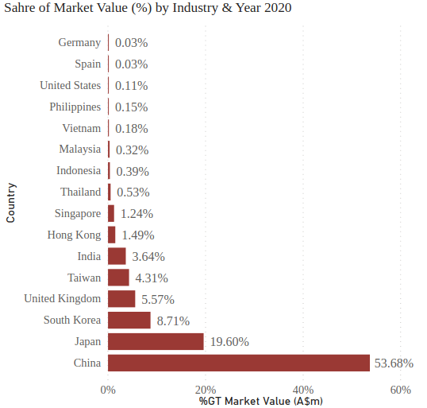 *Click for Intractive Dashboard - Page 7/9*](https://app.powerbi.com/view?r=eyJrIjoiYzA3NzU2NmQtOWFmYS00N2QxLWI4ZTQtY2Q2NDUxMGQ4ZDFkIiwidCI6IjU0ZjZkMTYyLTIzYTgtNDMxNy1iOGRmLTYxMGVkMzU4MTA4YyJ9&pageName=ReportSection)

Australia has exported more than $122 billion worth of Energy & Resources products to China in 2019-20 which stand for 54% of total export to major markets. Japan ranks second with $44 billion market value (20%). It may seem more interesting knowing that China's share of the export market was 2% three decades ago and Japan was Australia’s number one export destination till 2010.

[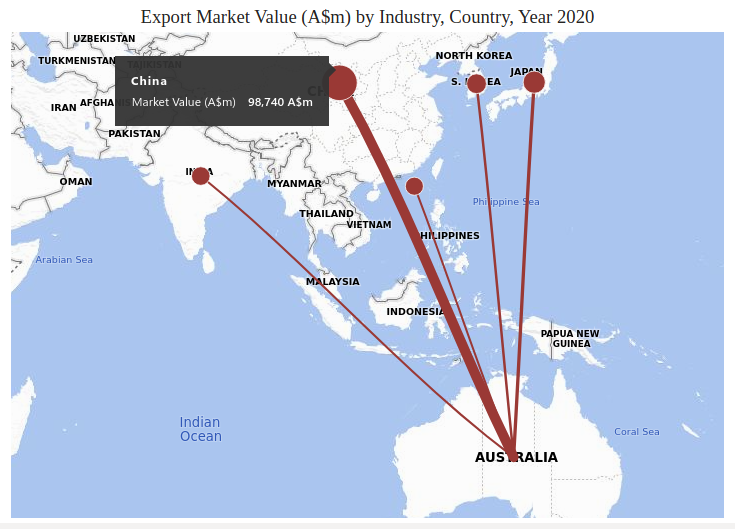 *Click for Intractive Dashboard - Page 6/9*](https://app.powerbi.com/view?r=eyJrIjoiYzA3NzU2NmQtOWFmYS00N2QxLWI4ZTQtY2Q2NDUxMGQ4ZDFkIiwidCI6IjU0ZjZkMTYyLTIzYTgtNDMxNy1iOGRmLTYxMGVkMzU4MTA4YyJ9&pageName=ReportSection)

However, the other end of this trade fight is China’s actual demand for Australian mining fruits. Iron Ore and Coal are by far the two largest export materials to China which both are key elements to steel production; the second largest industry in the world per se’. China's recent act to put pressure on Australia’s coal industry has been interpreted as an aggressive move, but probably in a long term view, they have to bear each other for a while to think over a way out of tension with least damage to both nation’s economies.

### GREENs May Need to Set Expectations Low

Climate and anti-fossil-fuel activists have a relatively strong voice in Australia. However, changes might happen slower than wishes. Resources and Energy, as the second largest industry in Australia has about a quarter of a million people directly employed. Although It is less than 2% of Australia’s workforce, however more than 80,000 are working in Coal, Oil, and Gas extraction industries alone. That apparently means it will take generations long to shift these industries.

[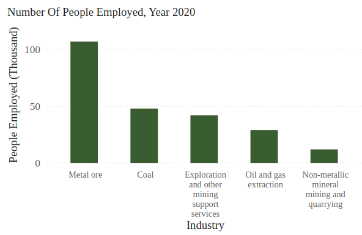 *Click for Intractive Dashboard - Page 4/9*](https://app.powerbi.com/view?r=eyJrIjoiYzA3NzU2NmQtOWFmYS00N2QxLWI4ZTQtY2Q2NDUxMGQ4ZDFkIiwidCI6IjU0ZjZkMTYyLTIzYTgtNDMxNy1iOGRmLTYxMGVkMzU4MTA4YyJ9&pageName=ReportSection)

Let social effects aside, obviously the main resistance to energy paradigm shift would be backed by the investors. Not simply because they benefit from it, but also because the income level is so high that mining $118 billion income in 2018-19 was almost as large as the whole Services sector income. It is not difficult to suppose that such a wealthy industry would have powerful allies in the parliament.

[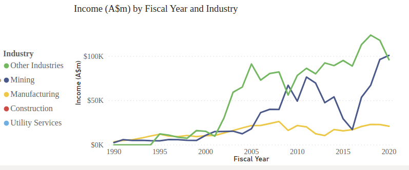 *Click for Intractive Dashboard - Page 5/9*](https://app.powerbi.com/view?r=eyJrIjoiYzA3NzU2NmQtOWFmYS00N2QxLWI4ZTQtY2Q2NDUxMGQ4ZDFkIiwidCI6IjU0ZjZkMTYyLTIzYTgtNDMxNy1iOGRmLTYxMGVkMzU4MTA4YyJ9&pageName=ReportSection)

Banking corporations concerned with public opinions, are announcing that they will stop lending to fossil fuel industries by a certain time in the future, but the fact is if there is only one industry that is not much dependent on the banks already, that would be the mining sector. In 2019, mining has borrowed $85 billion which stands for less than 3% of whole banks’ lending. In fact, finance and insurance businesses alone have borrowed almost $600 billion in the same period.

[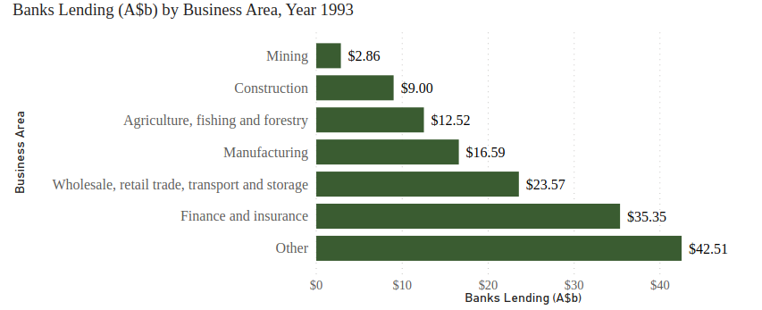 *Click for Intractive Dashboard - Page 9/9*](https://app.powerbi.com/view?r=eyJrIjoiYzA3NzU2NmQtOWFmYS00N2QxLWI4ZTQtY2Q2NDUxMGQ4ZDFkIiwidCI6IjU0ZjZkMTYyLTIzYTgtNDMxNy1iOGRmLTYxMGVkMzU4MTA4YyJ9&pageName=ReportSection)

And last but not the least, by having humankind hit by the Covid pandemic while everyone was so assured of the latest scientific breakthroughs and prospering economies all around the world, I personally expect governments to get more conservative with fast pace shifts in the economy. Especially Australia’s may seem more vulnerable to these kinds of disasters having a so-called modern economy.

### People and States

Energy and Resources become a more complex matter when it is addressed at the state level. Surprisingly, Victoria’s involvement in the mining industry is almost negligible. It only plays a role in the gold production and its share is 8% of Australia’s gold production.

[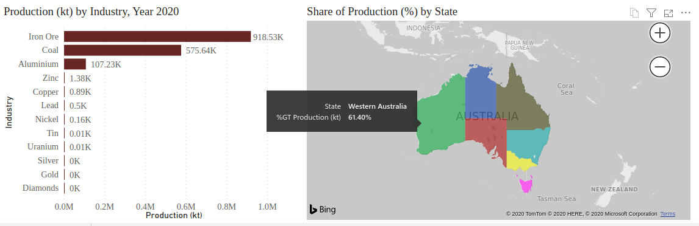 *Click for Intractive Dashboard - Page 8/9*](https://app.powerbi.com/view?r=eyJrIjoiYzA3NzU2NmQtOWFmYS00N2QxLWI4ZTQtY2Q2NDUxMGQ4ZDFkIiwidCI6IjU0ZjZkMTYyLTIzYTgtNDMxNy1iOGRmLTYxMGVkMzU4MTA4YyJ9&pageName=ReportSection)

When it comes to coal mining, NSW and QLD own almost the whole industry each 44.5% and 54% respectively. And WA is probably wealthiest by controlling Australia’s whole Iron Ore industry. In fact, all VIC, SA, NT, and TAS together benefit from less than 2% of the whole mining industry.

 

**Notes**

* Data Source : [Department of Industry and Science](https://publications.industry.gov.au/publications/resourcesandenergyquarterlyseptember2020/index.html)
* Dashboard : [Power BI](https://app.powerbi.com/view?r=eyJrIjoiYzA3NzU2NmQtOWFmYS00N2QxLWI4ZTQtY2Q2NDUxMGQ4ZDFkIiwidCI6IjU0ZjZkMTYyLTIzYTgtNDMxNy1iOGRmLTYxMGVkMzU4MTA4YyJ9&pageName=ReportSection)
* To try the Dashboard on desktop; Just download the template `EconAussie.pbit` and `datasources` and open with **`Power BI`**.